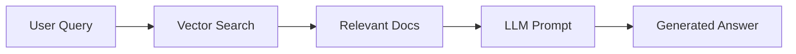
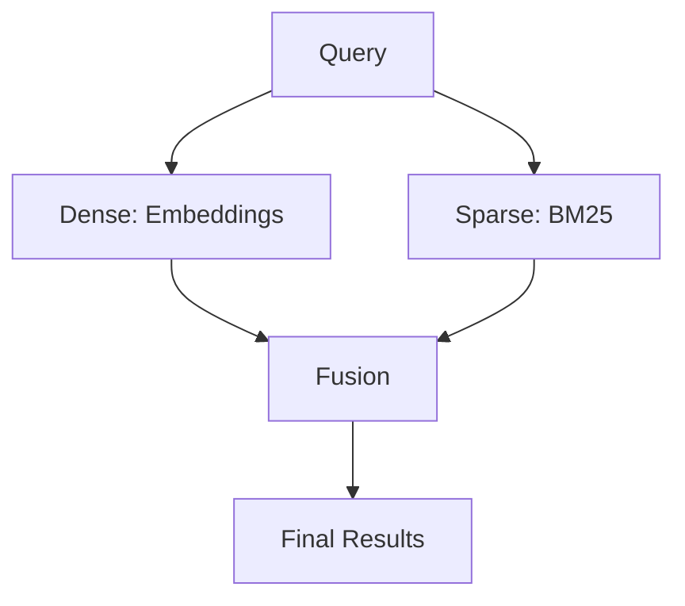

<p align="center">
  
  
  
  
</p>

<h1 align="center">🚀 RAG Implementation Masterclass</h1>

<p align="center">
  <strong>A comprehensive, production-ready implementation of Retrieval-Augmented Generation (RAG) patterns</strong>
</p>

<p align="center">
  <a href="#-features">Features</a> •
  <a href="#-quick-start">Quick Start</a> •
  <a href="#-project-structure">Structure</a> •
  <a href="#-implementations">Implementations</a> •
  <a href="#-tech-stack">Tech Stack</a>
</p>

---

## ✨ Features

| Feature                             | Description                                            |
| ----------------------------------- | ------------------------------------------------------ |
| 🔄 **End-to-End RAG Pipeline**      | Complete ingestion → retrieval → generation workflow   |
| 🧠 **Advanced Chunking Strategies** | Recursive, Semantic, and Agentic text splitting        |
| 🔍 **Multiple Retrieval Methods**   | Similarity, MMR, Score Thresholding, Multi-Query       |
| 🏆 **Reciprocal Rank Fusion**       | Combine results from multiple queries intelligently    |
| 💬 **Conversational RAG**           | History-aware question answering with context          |
| 🔀 **Hybrid Search**                | Combine dense and sparse retrieval methods             |
| ⚡ **Reranking**                    | Improve retrieval quality with cross-encoder reranking |

---

## 🚀 Quick Start

### Prerequisites

- Python 3.9+
- API keys for [VoyageAI](https://www.voyageai.com/) and [Google Gemini](https://aistudio.google.com/)

### Installation

```bash
# Clone the repository
git clone https://github.com/yourusername/RAG_Imp.git
cd RAG_Imp

# Create virtual environment
python -m venv venv
source venv/bin/activate  # On Windows: venv\Scripts\activate

# Install dependencies
pip install -r requirements.txt
```

### Configuration

Create a `.env` file in the project root:

```env
VOYAGE_API_KEY=your_voyage_api_key_here
GEMINI_API_KEY=your_gemini_api_key_here
```

### Run Your First RAG Pipeline

```bash
# 1. Add your documents to the docs/ folder
# 2. Run the ingestion pipeline
python 1_ingestion_pipeline.py

# 3. Query your documents
python 2_Retrieval_AnswerGen_Pipeline.py
```

---

## 📁 Project Structure

```
📦 RAG_Imp/
├── 📄 1_ingestion_pipeline.py          # Document loading & vector store creation
├── 📄 2_Retrieval_AnswerGen_Pipeline.py # Basic RAG query & answer generation
├── 📄 3_History_aware_generation.py    # Conversational RAG with chat history
├── 📄 4_recursive_character_text_splitter.py # Basic text chunking
├── 📄 5_semantic_chunking.py           # Embedding-based semantic chunking
├── 📄 6_agentic_chunking.py            # LLM-powered intelligent chunking
├── 📄 7_multi_modal_rag.ipynb          # Multi-modal RAG (images + text)
├── 📄 8_retrieval_methods.py           # Similarity, MMR, Score Threshold
├── 📄 9_multi_query_retrieval.py       # Query expansion retrieval
├── 📄 10_reciprocal_rank_fusion.py     # RRF for multi-query fusion
├── 📄 12_hybrid_search.ipynb           # Dense + Sparse retrieval
├── 📄 13_reranker.ipynb                # Cross-encoder reranking
├── 📁 docs/                            # Your source documents
├── 📁 db/                              # ChromaDB vector store
└── 📄 requirements.txt                 # Python dependencies
```

---

## 📚 Implementations

### 1️⃣ Document Ingestion Pipeline

> `1_ingestion_pipeline.py`

Load documents, chunk them, generate embeddings, and store in ChromaDB.

```python
# Load documents → Split into chunks → Create embeddings → Store in vector DB
documents = load_documents("docs/")
chunks = split_documents(documents, chunk_size=1000)
vectorstore = create_vector_store(chunks)
```

**Key Features:**

- 📂 Automatic directory loading with `DirectoryLoader`
- ✂️ Configurable chunk size and overlap
- 💾 Persistent ChromaDB storage with cosine similarity

---

### 2️⃣ Retrieval & Answer Generation

> `2_Retrieval_AnswerGen_Pipeline.py`

Query your vector store and generate answers using Gemini.



---

### 3️⃣ Conversational RAG

> `3_History_aware_generation.py`

Chat with your documents with full conversation history support.

```python
# Maintains context across multiple questions
ask_question("Who founded Tesla?")
ask_question("When did he become CEO?")  # "he" refers to previous answer
```

**Key Features:**

- 🔄 Automatic query rewriting using conversation context
- 📝 Full chat history management
- 🎯 Context-aware document retrieval

---

### 4️⃣ Advanced Chunking Strategies

#### Semantic Chunking (`5_semantic_chunking.py`)

Splits text based on **semantic similarity** rather than fixed character counts.

```python
semantic_splitter = SemanticChunker(
    embeddings=VoyageAIEmbeddings(model="voyage-4"),
    breakpoint_threshold_type="percentile",
    breakpoint_threshold_amount=70
)
```

#### Agentic Chunking (`6_agentic_chunking.py`)

Uses an **LLM to intelligently decide** where to split documents.

```python
# LLM analyzes content and places <<<SPLIT>>> markers
# at logical topic boundaries
```

---

### 5️⃣ Retrieval Methods

> `8_retrieval_methods.py`

| Method                | Description                      | Best For            |
| --------------------- | -------------------------------- | ------------------- |
| **Similarity Search** | Top-k most similar docs          | General queries     |
| **Score Threshold**   | Only docs above similarity score | High precision      |
| **MMR**               | Balance relevance + diversity    | Avoiding redundancy |

---

### 6️⃣ Multi-Query Retrieval

> `9_multi_query_retrieval.py`

Expands a single query into multiple variations for better coverage.

```python
Original: "How does Tesla make money?"
    ↓
Variations:
  1. "What are Tesla's revenue streams?"
  2. "Tesla business model and income sources"
  3. "How does Tesla generate profits?"
```

---

### 7️⃣ Reciprocal Rank Fusion (RRF)

> `10_reciprocal_rank_fusion.py`

Intelligently combines results from multiple queries using RRF algorithm.

```python
# RRF Score = Σ (1 / (k + position))
# Documents appearing in multiple queries get boosted
fused_results = reciprocal_rank_fusion(all_results, k=60)
```

**Benefits:**

- ✅ Documents in multiple results get higher scores
- ✅ Position-aware weighting
- ✅ Robust fusion across query variations

---

### 8️⃣ Hybrid Search

> `12_hybrid_search.ipynb`

Combines **dense retrieval** (embeddings) with **sparse retrieval** (BM25).



---

### 9️⃣ Reranking

> `13_reranker.ipynb`

Uses cross-encoder models to rerank initial retrieval results for higher precision.

---

## 🛠️ Tech Stack

| Component        | Technology              |
| ---------------- | ----------------------- |
| **LLM**          | Google Gemini 2.5 Flash |
| **Embeddings**   | VoyageAI (voyage-4)     |
| **Vector Store** | ChromaDB                |
| **Framework**    | LangChain               |
| **Reranking**    | Cohere                  |

---

## 📋 Requirements

```txt
langchain>=0.3.0,<0.4.0
langchain-core>=0.3.15,<0.4.0
langchain-community>=0.3.0,<0.4.0
langchain-chroma>=0.2.0,<0.3.0
langchain-text-splitters>=0.3.0,<0.4.0
langchain-experimental>=0.3.0,<0.4.0
langchain-cohere>=0.3.0,<0.4.0
langchain-voyageai
google-genai
python-dotenv
rank_bm25>=0.2.2
```

---

## 🤝 Contributing

Contributions are welcome! Feel free to:

1. Fork the repository
2. Create a feature branch (`git checkout -b feature/amazing-feature`)
3. Commit your changes (`git commit -m 'Add amazing feature'`)
4. Push to the branch (`git push origin feature/amazing-feature`)
5. Open a Pull Request

---

## 📄 License

This project is open source and available under the [MIT License](LICENSE).

---

<p align="center">
  Made with ❤️ by <strong>Bhupesh Danewa</strong>
</p>

<p align="center">
  <sub>⭐ Star this repo if you find it helpful!</sub>
</p>
